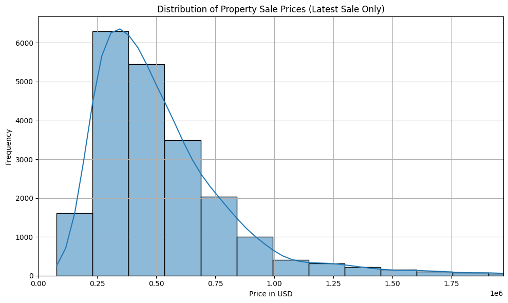

# EDA Project: Real State Exploratory Analysis EDA

Notebooks in this repo will help Amy Williams to decide which houses to sell, and which to buy.

# Real Estate EDA
Exploratory data analysis of a housing dataset to identify price drivers and data quality issues.

## Highlights
- Role: Data exploration, feature inspection, basic modeling setup.
- Tech: Python, Pandas, NumPy, Jupyter, Matplotlib.
- Outcome: Cleaned dataset + insights (outliers, correlations, next-step features).




## Run
Open the notebook in Jupyter (`.ipynb`).


__Group__: Vanesa and Robin

__Original task from [NeueFische Repo](https://github.com/neuefische/ds-eda-project-template/blob/main/assignment.md)__:

>Mafiosi, 
(1) sells several central houses(top10%) over time, 
(2) needs average outskirt houses over time to hide from the FBI

---

## 🚀 Installation

```bash
git clone https://github.com/vaneyepes/eda_realstate.git
cd eda_realestate
pip install -r requirements.txt
````

---

## 📓 Notebooks

- [Notebook Part 0](part0_import_from_dbeaver.ipynb): Import from DBeaver: Used to create the eda.csv file from DBeaver
- [Notebook Part 1](part1_univariate.ipynb): Explains step by step how we analysed the data and added more columns and information to the dataset
- [Notebook Part 2](part2_multivariate_and_tasks.ipynb): Analyses multivariate data and gives answers to our client's task
- [Presentation](https://www.canva.com/design/DAGuKdwCiLQ/gbAiwd6F4imcgRigyroa0A/edit?utm_content=DAGuKdwCiLQ&utm_campaign=designshare&utm_medium=link2&utm_source=sharebutton): Summary and illustration of our findings
